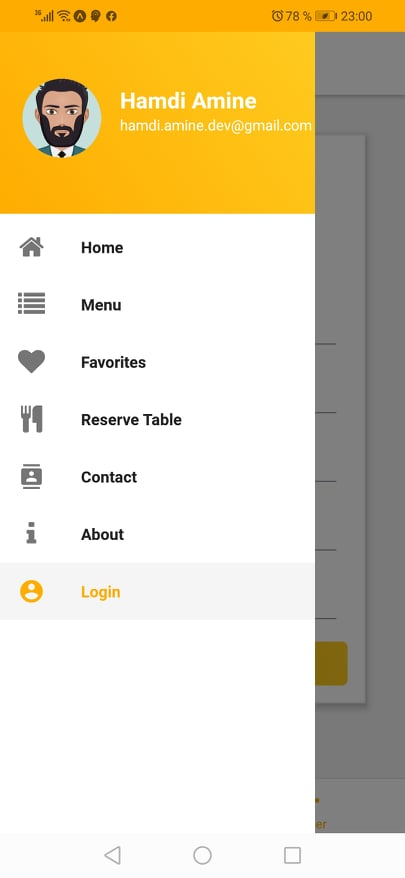
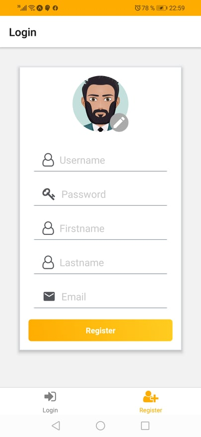
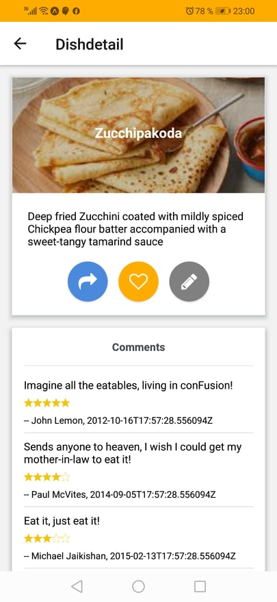

# Coursera react-native app

It's a simple react native application for a restaurent created in the course https://www.coursera.org/learn/react-native

This course focuses on developing truly cross-platform, native iOS and Android apps using React Native (Ver 0.55) and the Expo SDK (Ver. 27.0.0). React Native uses modern JavaScript to get truly native UI and performance while sharing skills and code with the web. You will learn about UI development with React Native UI and layout support and access the native mobile platform's capabilities from Javascript using the Expo SDK. You should have already completed the Bootstrap 4 and the React courses in this specialization before proceeding with this course.

## API

We use a fake API with https://my-json-server.typicode.com/AmineVolk/coursear-react-native-db/

this fake server use a file stored in : https://github.com/AmineVolk/coursear-react-native-db

## Some application screen

